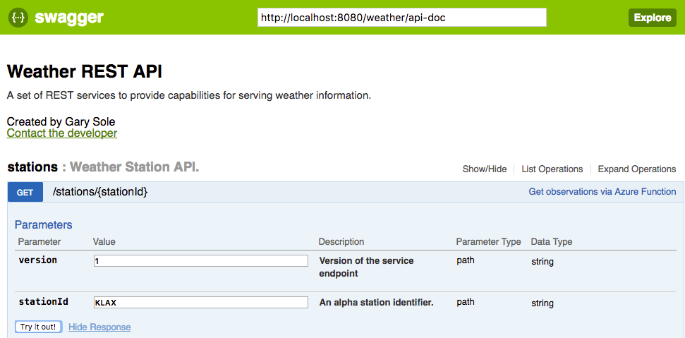

Fuse Integration Services (FIS) Weather Station API Demo
====================================

This project demonstrates how to expose an existing XML-based Weather Station API with Fuse Integration Services 2.0 and 3scale.

## Overview

This project demonstrates a microservices based project leveraging SpringBoot and Apache Camel to proxy an existing XML-based API with a new REST front-end service.  Additionally, the REST API is documented using Swagger.  The project makes use of camel-servlet component listening on port 8080 and configured using Spring Boot.

## Prerequisites

An OpenShift environment must be present for deployment to to a cloud environment.  For the purpose of testing, I prefer to use [Minishift](https://fabric8.io/guide/getStarted/minishift.html)

## Deployment

This project can be deployed using two methods:

* Standalone Spring-Boot container
* On an Openshift environment using Fuse Integration Services 2.0

## Standalone Spring Boot Container

The standalone method takes advantage of the [Camel Spring Boot Plugin](http://camel.apache.org/spring-boot.html) to build and run the microservice.

Execute the following command from the root project directory:

```
mvn -s configuration/settings.xml spring-boot:run -Dspring.profiles.active=dev
```

Once the spring boot service has started, you can test the REST API by executing the following command

```
curl -X GET --header 'Accept: application/json' 'http://localhost:8080/weather/stations/KLAX' | python -m json.tool
```

A list of details pertaining to the US weather station at LAX airport is returned.  Try other airports as needed e.g. KBID, KBOS,KPVD.  The API will accept airport identifies either starting with 'K' or without.

It's also possible to navigate the REST service using the Swagger documentation [here](http://localhost:8080/index.html).

## Openshift / Minishift Deployment

First, create a new OpenShift project called *weather-apis*

```
oc new-project weather-apis --description="Fuse Integration Services Weather API Demo" --display-name="Weather API"
```

Execute the following command which will execute the *ocp* profile that executes the `clean fabric8:deploy` maven goal:

```
mvn -s configuration/settings.xml -P ocp
```

The fabric8 maven plugin will perform the following actions:

* Compiles and packages the Java artifact
* Creates the OpenShift API objects
* Starts a Source to Image (S2I) binary build using the previously packaged artifact
* Deploys the application using binary streams

## Swagger UI

A [Swagger User Interface](http://swagger.io/swagger-ui/) is available within the rest-soap-transformation application to view and invoke the available services. 

Select the hyperlink for the gateway application to launch the Swagger UI



The raw swagger definition can also be found at the context path `weather/api-doc` 

## Command Line Testing

Using a command line, execute the following to query the definition service

```
curl -s http://$(oc get routes weather-station-api --template='{{ .spec.host }}')/weather/stations/KLAX | python -m json.tool
```
	
A successful response will output the following

```
{
    "displayName": "LOS ANGELES                                                                                         ",
    "elevation": 126,
    "id": "KLAX     ",
    "latitude": 33.9425,
    "longitude": -118.408055,
    "observesDaylightSavings": "Y",
    "placeName": "LOS ANGELES INTL                                                                                    ",
    "timeZone": "PT             "
}
```
